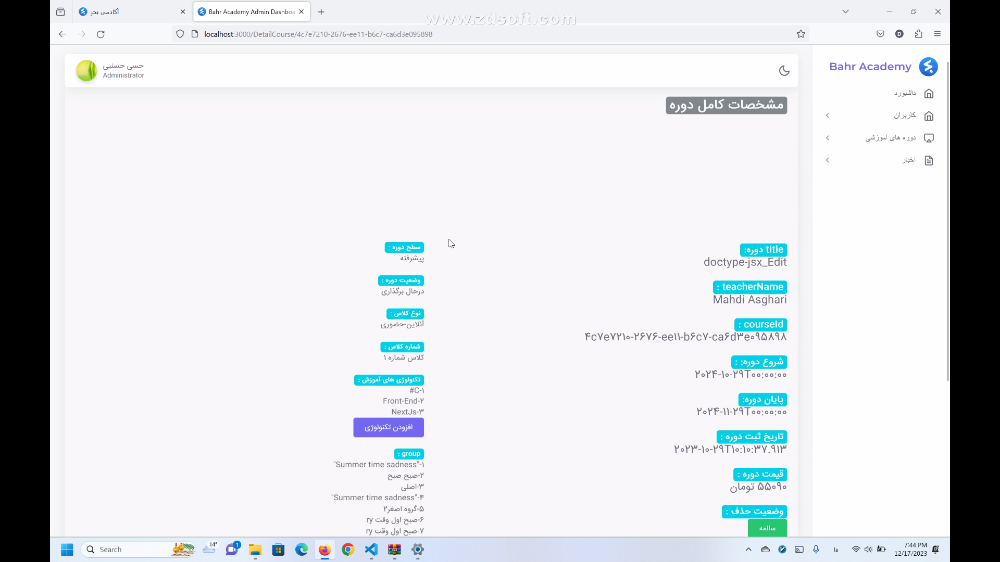
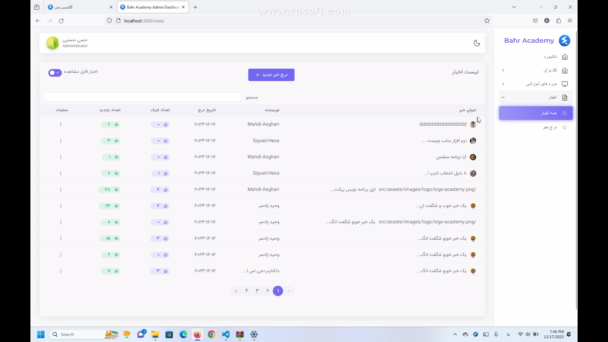

# Educational-website with react vite

An educational website admin pannel that you can manage courses, members and news.
Built with vuexy ready panel (react framework).

## Authors

- [@arefsalarieh](https://github.com/arefsalarieh)
- [@vahidzadsar](https://github.com/vahid-zed)
- [@SomayehMokarramiR](https://github.com/SomayehMokarramiR)


## Tech Stack

 vuexy , React , react-query , Redux , axios , formik , yup ,react-router-dom , TailwindCSS , antd , framer-motion , react-hot-toast , swiper


## important

To view the panel pages, you need an account with admin access, but to view the pages without data, you can remove the token requirement in interceptor.


## Installation

1 - clone this repo

```bash
https://github.com/arefsalarieh/Educational-website-admin-pannel.git
```

2 - install packages

```bash
npm i --force
```

3 - run the project

```bash
npm satrt
```
    

##  pages








